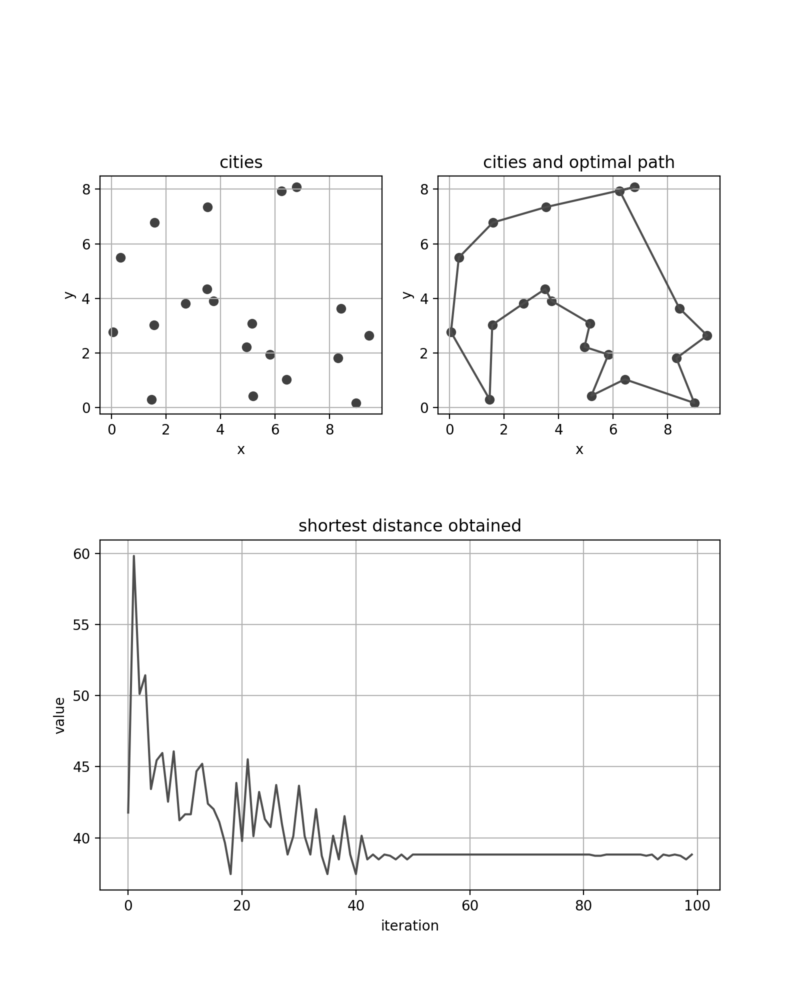
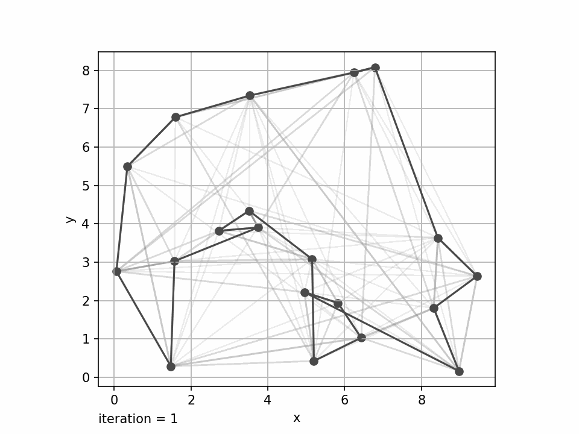

# Ant Colony Optimization
This metaheuristic optimization algorithm inspired by ants behaviour attempts to find the most optimal solution of a given problem expressed in a form of graph $G$ being a tuple of components $C$ and connections $L$ between them, i.e., $G = (C, L)$. There are many variations of its implementation. The one that has been adapted in this project is the _Ant System_.

## Principle of operation
The core concept of the Ant Colony Optimization algorithm is the _pheromone_ trail the ants leave after traveling between nodes on the graph. Its value is used for the other ants to determine which node to choose next. The greater the value of the pheromone trail joining specific node, the greater the probablity that the ant will select it.

### Node selection
The probability of choosing node $j$ while being in node $i$ by ant $k$ is determined by the following expression:
```math
p_{ij} = \frac{\tau_{ij}^\alpha \eta_{ij}^\beta}{\sum_{l\in N_{i}^{k}} \tau_{il}^\alpha \eta_{il}^\beta}
```
where:
- $\tau_{ij}$: pheromone value between nodes $i$ and $j$,
- $\eta_{ij}$: heuristic visibility,
- $\alpha$, $\beta$: parameters which determine the relative influence of pheromone value and heuristic visibility,
- $N_{i}^{k}$: feasible neighbourhood for ant $k$ when being in city $i$.

### Pheromone trails update
In the algorithm initialization step, pheromone matrix $\tau$ values are determined using _nearest neighbour_ heuristic and are set to $\tau_0 = \frac{m}{C}$, where $m$ is the ants numeber, and $C$ is the path length obtained by the nearest neighbour algorithm. In the next iterations, after ants finish their tours, each pheromone trail is updated as in the following expression:
```math
\tau_{ij} \leftarrow (1-\rho)\cdot \tau_{ij} + \sum_{k=1}^{m}\Delta \tau_{ij}^{k}
```
The evaporation rate $\rho$ is responsible for weakening the pheromone trail on between nodes $i$ and $j$.

The $\Delta \tau_{ij}^{k}$ is set to $\frac{Q}{L^k}$ if the ant $k$ used connection $(i, j)$, or to 0 if it didn't. $Q$ is a constant algorithm parameter, and $L^k$ is the tour length made by the ant $k$.

# Traveling Salesman Problem solution
The Traveling Salesman Problem (TSP) can be respresented as graph $G$ which components $C$ are cities, and connections $L$ the distances between each.

If $C$ is a vector of length $n$, the $L$ is a square matrix of a size $n \times n$. Each value $d_{ij}$ in the $L$ matrix corresponds with the distance between cities $c_i$ and $c_j$ from the $C$ vector. The $\eta$ matrix is of the same size as $L$ and each $\eta_{ij}$ value is reciprocal of each $d_{ij}$ value.  

The graphs below present a sample TSP solution for 20 cities randomly distributed on a $x-y$ plane. Parameters which have been used to produce this output have been given following values: $m$: 10; $\rho$: 0.5; $\alpha$: 1; $\beta$: 2; $Q$: 1.

<p align="center"></p>

The animation below shows solution evolution. Each iteration shows the shortest tour made by one of the ants in a given iteration and the pheromone trails left by every of them. It can be noticed how the trails disappear as the tour distance converges to an optimal solution over the algorithm iterations.
<p align="center"></p>

# References
1. M. Dorigo, M. Birattari and T. Stutzle, "Ant colony optimization" in IEEE Computational Intelligence Magazine, vol. 1, no. 4, pp. 28-39, Nov. 2006, doi: 10.1109/MCI.2006.329691.
2. M. Dorigo and T. Stützle, "Ant Colony Optimization" in The MIT Press 2004, doi: https://doi.org/10.7551/mitpress/1290.001.0001
